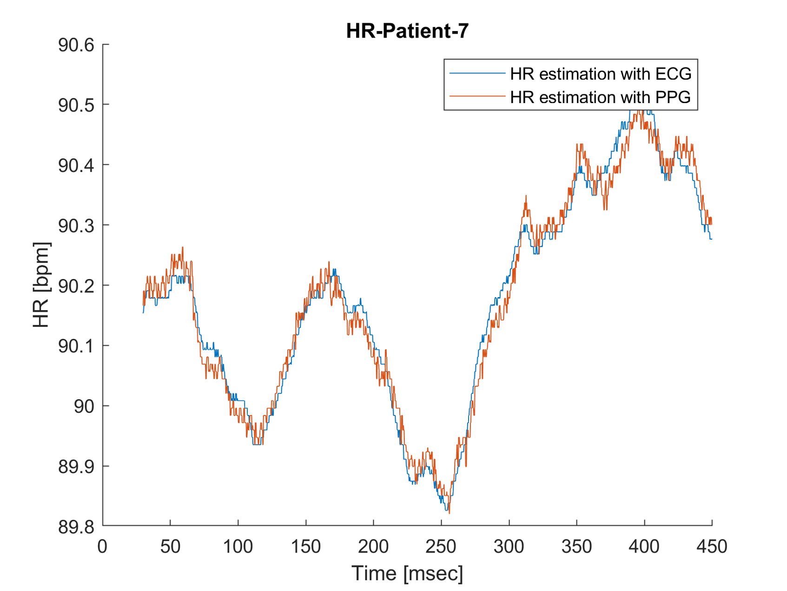

# Project topic: Processing and Analysis of PPG/ECG
Course: Biomedical data acquisition and signal processing

Coordinator: Professor Kugiumtzis Dimitris

Students: Magdalini Anastasiadou & Chrysanthi Ntasioti

## Introduction
- The dataset for the project was [“BIDMC PPG and Respiration Dataset”](https://physionet.org/content/bidmc/1.0.0/).
- The dataset was acquired from 53 critically ill patients under hospital care. 
- Each recording lasted 8 minutes, containing
physiological signals such as Photoplethysmography (PPG), and
Electrocardiography (ECG), all sampled at 125 Hz. 

## Task
The aim of this project was to investigate the possibility of using PPG signals to monitor the
HR of critically ill patients, this is assessed compared to using ECG signals.

## Methodology
1. Pre-processing and Filtering

        a. Detrending
        b. High pass filter (cutoff frequency at 0.5 Hz to correct the baseline)
        c. Low pass filter (cutoff frequency at 50 Hz to decrease the noise)
        d. Normalization

    
    

2. HR Extraction

HR estimated at a rate of 4Hz from each signal and extracted from a sliding time window of 60 sec.

    

        a. ECG HR using Pan-Tompkins
        b. PPG HR using peak detection and SDSD minimization.

3. Comparison of Results

        a. Statistical
        b. Visual
        

    
    

    
    

    
    

    
    
    

4. Conclusions

        a. PPG is promising in replacing ECG for HR monitoring
        b. The maximum absolute error:7.77 (Patient 19)
        c. More thorough analysis - critically ill patients
        d. PPG less accurate data for heart rate measurement compared to ECG 
